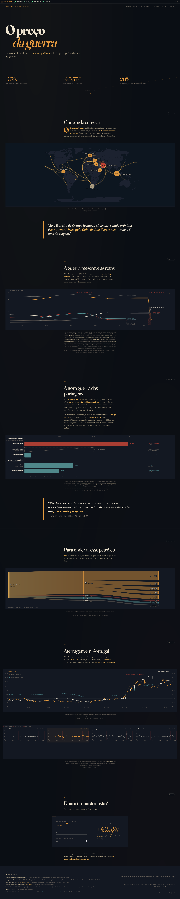

# 🛢️ O Preço da Guerra


> **Sistemas de Visualização de Dados e Conhecimento** | Mestrado em Inteligência Artificial | Universidade do Minho | 2025/26
>
> **Modalidade:** Avaliação 2 (Grupo) · **Tipo:** *Data story* · **Apresentação oral:** 28 Maio 2026

*Data story* interactiva em **D3.js v7** que segue o petróleo desde o Estreito de Ormuz até à bomba de gasolina em Portugal, no contexto da guerra Irão–EUA/Israel iniciada a 28 de Fevereiro de 2026. Integra **8 datasets relacionados** de fontes oficiais (EIA, FRED, Eurostat, BPstat, DGEG, Wayback Machine, Natural Earth, e estimativas STEO).

---

## 🏆 Conquistas

* **Pipeline automatizada:** 7 fontes oficiais integradas, atualização diária via GitHub Actions, zero intervenção manual.
* **Recuperação histórica:** Wayback Machine usada para extrair tabelas EIA de 2017–2024 que já não estão online — série temporal estendida de 6 para 14 anos.
* **Pipeline resiliente:** cada script tem fallback secundário e *retries* exponenciais; se ambas as fontes falharem, o CSV anterior fica intacto.
* **Live status bar** com indicador 🟢/⚪ por fonte — exposição honesta do estado dos dados ao leitor.

---

## 📊 Resultados



### Impacto da guerra (Fev 2026 → Abr 2026)

| Indicador | Pré-guerra (1H 2025) | Pico do conflito (Abr 2026) | Δ |
|-----------|---------------------:|----------------------------:|-----:|
| Fluxo no **Estreito de Ormuz** (mb/d) | 20,9 | ~4,0 *(estimativa)* | **−81%** |
| Fluxo pelo **Cabo da Boa Esperança** (mb/d) | 9,1 | ~13,5 *(estimativa)* | +48% |
| **Produção parada** no Médio Oriente (mb/d) | 0 | 9,1 *(STEO)* | — |
| **Brent crude** ($/barril) | 81 | 128 *(pico 2 Abr)* | +58% |
| **Gasóleo simples** em Portugal (€/L) | 1,60 | 2,03 | +27% |
| Portagem por navio em Ormuz | $0 | $1,5 M *(imposta)* | precedente histórico |

A assimetria entre a queda de Ormuz (−17 mb/d) e a subida do Cabo (+4,5 mb/d) é o ponto editorial central: quase metade do petróleo que devia estar a fluir **desapareceu do mercado** porque a Ásia não tem rota alternativa razoável.

### Capítulos

| # | Capítulo | Visualização | Mensagem |
|---|----------|--------------|----------|
| I | *O ponto que sustenta o mundo* | Mapa-mundo + 21 rotas + 8 chokepoints | 20% do petróleo mundial passa por uma faixa com a largura de Braga–Guimarães |
| II | *A guerra reescreve as rotas* | Multi-line 2011–2025 + linha tracejada + faixa de incerteza + hatched | Quase metade do petróleo desaparece |
| II½ | *A nova guerra das portagens* | Bar chart agrupado (estreitos vs canais) | Primeira portagem da história num estreito natural |
| III | *Para onde vai esse petróleo* | Sankey Ormuz → Região → País | 89% vai para a Ásia |
| IV | *O custo no bolso* | Brent + combustíveis (dual-axis) + inflação COICOP (small multiples) | Brent +58%, gasóleo €1,60→€2,03 |
| V | *Quanto custa a ti?* | Calculadora interativa (3 sliders) | Macro → pessoal |

> 🖼️ **Screenshots:** [`docs/`](docs/) (`screenshot-hero.png`, `-mapa.png`, `-fluxos.png`, `-portagens.png`, `-sankey.png`, `-precos.png`, `-inflacao.png`, `-calculadora.png`, `-fullpage.png`)

---

## ⚙️ Implementações

### Visualizações D3.js

- **Mapa Natural Earth** (Cap. I) — `geoNaturalEarth1` + TopoJSON `world-atlas@2`, círculos com `√mb/d`, rede de 21 rotas com `d3.curveCatmullRom`, glow filter SVG.
- **Multi-line com estimativas** (Cap. II) — 8 séries em 3 níveis de hierarquia, linha tracejada pós-guerra, `d3.area` para faixa de incerteza, `<pattern>` SVG para hatched (shut-in), anotações verticais.
- **Bar chart agrupado** (Cap. II½) — ghost bar + diagonal strike-through animada para a proposta indonésia recusada.
- **Sankey** (Cap. III) — `d3-sankey` com fluxos em mb/d derivados de % share.
- **Dual-axis temporal** (Cap. IV) — Brent USD à esquerda, combustíveis EUR à direita, hover bisector cruza os 3 valores.
- **Small multiples** (Cap. IV) — 4 painéis COICOP com escala partilhada, painel Transportes destacado.
- **Calculadora interativa** (Cap. V) — 3 sliders, lê preços ao vivo do CSV com fallback editorial.

### Pipeline Python

- **`api/fluxos.py`** — EIA scraping + Wayback Machine CDX (1 snapshot/ano desde 2017), normalização de cabeçalhos `"1H25"→"1H2025"`, footnote-stripping contra conjunto `KNOWN_CHOKEPOINTS`, pivot wide→long, dedupe `keep='last'`.
- **`api/brent.py`** — FRED (DCOILBRENTEU) + Yahoo Finance (`BZ=F`) com merge `keep='last'`, 3 *retries* com *backoff* exponencial.
- **`api/combustiveis.py`** — DGEG API PMD com fallback GET→POST, parse de `"1,1900 €"` para float, overlap de 15 dias para apanhar revisões retroativas.
- **`api/inflacao.py`** — Eurostat HICP (`prc_hicp_manr`) + BPstat com `combine_first`, sem valores inventados (NaN se nenhuma fonte publicou).

### Decisões de design

- **Paleta limitada:** amber (Ormuz), ink (Cabo), rust (disrupção), teal (Suez). 6 capítulos sem reaprender cores.
- **Tipografia tripartida:** *Fraunces* (display), *Newsreader* (corpo), *JetBrains Mono* (números).
- **3 padrões visuais distintos para estimativa:** tracejado (linha estimada), faixa transparente (intervalo de incerteza), hatched diagonal (produção parada).
- **Lazy-load** via `IntersectionObserver` — charts só renderizam ao entrar no viewport.
- **Responsivo** via `viewBox` + `preserveAspectRatio`, re-render selectivo em resize (debounce 200 ms).
- **Acessibilidade** — `aria-label` em cada `div.viz`, `prefers-reduced-motion` desactiva animações longas, contraste WCAG AA.

---

## 🗃️ Construção dos Dados

### Fontes integradas

| Dataset | Fonte primária | Fallback | Atualização | Script |
|---------|----------------|----------|-------------|--------|
| **Chokepoints — fluxos** | [EIA *World Oil Transit Chokepoints*](https://www.eia.gov/international/analysis/special-topics/World_Oil_Transit_Chokepoints) | Wayback Machine (snapshots anuais 2017+) | Anual | `api/fluxos.py` |
| **Hormuz — destinos** | EIA — regex sobre %Ásia + %Top4 | Tabela base editorial | Anual | `api/fluxos.py` |
| **Brent diário** | [FRED — `DCOILBRENTEU`](https://fred.stlouisfed.org/series/DCOILBRENTEU) | [Yahoo Finance `BZ=F`](https://finance.yahoo.com/quote/BZ%3DF) | Diário | `api/brent.py` |
| **Combustíveis PT** | [DGEG — API PMD](https://precoscombustiveis.dgeg.gov.pt/) (GET→POST) | — | Diário | `api/combustiveis.py` |
| **Inflação COICOP** | [Eurostat `prc_hicp_manr`](https://ec.europa.eu/eurostat) | [BPstat — Banco de Portugal](https://bpstat.bportugal.pt/) | Mensal | `api/inflacao.py` |
| **Portagens** | Bloomberg, Iran Intl., *The Diplomat*, Lowy Inst., autoridades dos canais | — | Snapshot (Mar–Abr 2026) | inline JS |
| **Estimativas wartime/shut-in** | EIA *Short-Term Energy Outlook* (Abr 2026) | — | Editorial | `data/processed/{wartime,shutin}.csv` |
| **Mapa-mundo** | [Natural Earth via `world-atlas`](https://github.com/topojson/world-atlas) | — | — | — |

### Pipeline DataOps

GitHub Action diário (`.github/workflows/update.yml`) corre os 4 scripts Python, atualiza os CSVs em `data/processed/`, e faz commit para `main`. **A página limita-se a ler esses CSVs com `d3.csv()`** — sem CORS, sem chaves de API no browser.

### Datasets finais

| Ficheiro | Linhas | Usado em |
|----------|-------:|----------|
| `chokepoints.csv` | ~100 | Cap. I + II — 8 chokepoints × 14 anos |
| `hormuz.csv` | 8 | Cap. III — destinos do Ormuz |
| `wartime.csv` | 8 | Cap. II — estimativa STEO |
| `shutin.csv` | 3 | Cap. II — produção parada |
| `brent.csv` | ~2 500 | Cap. IV — preços diários desde 2016 |
| `combustiveis.csv` | ~4 000 | Cap. IV + V — gasolina 95 + gasóleo |
| `inflacao.csv` | ~360 | Cap. IV — small multiples COICOP |

---

## 📂 Estrutura do Repositório

```
SVDC3/
├── index.html                          # Página única (6 capítulos narrativos)
├── README.md
├── requirements.txt                    # Dependências Python do pipeline
├── .github/workflows/update.yml        # GitHub Action — pipeline diário (08:00 UTC)
│
├── css/
│   └── styles.css                      # Tema editorial dark, variáveis CSS, responsivo
│
├── js/
│   ├── api.js                          # Leitura de CSVs com fallback
│   └── main.js                         # Visualizações D3 + calculadora + LiveStatus
│
├── api/                                # Pipeline (corre no CI)
│   ├── brent.py                        #   FRED + Yahoo, merge keep='last'
│   ├── combustiveis.py                 #   DGEG, GET→POST fallback, incremental
│   ├── inflacao.py                     #   Eurostat HICP + BPstat combine_first
│   └── fluxos.py                       #   EIA live + Wayback + parsing Ormuz
│
├── utils/                              # Bootstrap (corre uma vez)
│   ├── dgeg.py
│   └── fred.py
│
├── data/
│   ├── raw/                            # Snapshots originais (bootstrap)
│   │   ├── dgeg.csv
│   │   └── FRED.csv
│   └── processed/                      # CSVs consumidos pelo site
│       ├── chokepoints.csv             ← api/fluxos.py
│       ├── hormuz.csv                  ← api/fluxos.py
│       ├── wartime.csv                 ← editorial (STEO Abr 2026)
│       ├── shutin.csv                  ← editorial (STEO Abr 2026)
│       ├── brent.csv                   ← api/brent.py
│       ├── combustiveis.csv            ← api/combustiveis.py
│       └── inflacao.csv                ← api/inflacao.py
│
└── docs/                               # Screenshots dos capítulos
    ├── screenshot-fullpage.png
    ├── screenshot-hero.png
    ├── screenshot-mapa.png
    ├── screenshot-fluxos.png
    ├── screenshot-portagens.png
    ├── screenshot-sankey.png
    ├── screenshot-precos.png
    ├── screenshot-inflacao.png
    └── screenshot-calculadora.png
```

**Fluxo de dados:** `api/*.py` (diário via GH Actions) → `data/processed/*.csv` → `js/api.js` → `js/main.js` → DOM

---

## 🚀 Reprodução

### Pré-requisitos

* **Python 3.11+** (para regenerar os CSVs)
* Qualquer servidor HTTP local (D3 precisa de um — `file://` esbarra em CORS)

### Passos

1. **Clonar o repositório:**
   ```bash
   git clone https://github.com/Luismpso/SVDC3.git
   cd SVDC3
   ```

2. **Servir a página:**
   ```bash
   python3 -m http.server 8000
   # abrir http://localhost:8000
   ```
   Alternativas: `npx serve .` ou extensão **Live Server** no VS Code.

3. **Regenerar os CSVs (opcional — o GitHub Action fá-lo diariamente):**
   ```bash
   pip install -r requirements.txt
   python api/fluxos.py        # EIA + Wayback → chokepoints.csv + hormuz.csv
   python api/brent.py         # FRED + Yahoo → brent.csv
   python api/combustiveis.py  # DGEG → combustiveis.csv
   python api/inflacao.py      # Eurostat + BPstat → inflacao.csv
   ```

4. **Bootstrap inicial (só na primeira vez):**
   ```bash
   python utils/dgeg.py        # data/raw/dgeg.csv  → data/processed/combustiveis.csv
   python utils/fred.py        # data/raw/FRED.csv  → data/processed/brent.csv
   ```

---

## 🎥 Apresentação

| Tempo | Capítulo | Mensagem-chave |
|-------|----------|----------------|
| 0:00–0:30 | Hero + Cap. I | "20% do petróleo mundial passa por uma faixa com a largura de Braga–Guimarães" |
| 0:30–1:30 | Cap. II | "A guerra reescreve as rotas — quase metade do petróleo desaparece" |
| 1:30–2:15 | Cap. II½ | "Primeira portagem da história num estreito natural" |
| 2:15–2:45 | Cap. III | "89% vai para a Ásia, mas o preço fixa-se em todo o mundo" |
| 2:45–4:00 | Cap. IV | "Em Portugal: Brent +58%, gasóleo €1,60 → €2,03" |
| 4:00–4:30 | Cap. V | Calculadora ao vivo — "Quanto custa a ti?" |
| 4:30–5:00 | Fecho + Q&A | Pergunta para a audiência |

---

## 👥 Grupo 1 — MIA

| Nome | Nº | Email |
|------|----|-------|
| Luís Miguel Pereira Silva | PG60390 | pg60390@alunos.uminho.pt |
| Guilherme Lobo Pinto | PG60225 | pg60225@alunos.uminho.pt |

---

## 📜 Licença

Trabalho académico no âmbito do Mestrado em Inteligência Artificial da Universidade do Minho. Dados sob as licenças das respectivas fontes:

- **EIA** (chokepoints + STEO) · domínio público (US gov)
- **FRED** (`DCOILBRENTEU`) · St. Louis Fed, uso académico permitido
- **Yahoo Finance** (`BZ=F`) · uso pessoal/académico
- **DGEG** (preços médios diários) · dados oficiais portugueses, abertos
- **Eurostat** (HICP) · CC BY 4.0 com atribuição
- **BPstat** (Banco de Portugal) · acesso aberto não comercial
- **Internet Archive** (Wayback Machine) · uso académico permitido
- **Natural Earth** · domínio público
- **Bloomberg, Iran Intl., The Diplomat, Lowy Inst.** · citações editoriais sob *fair use*

As estimativas em `wartime.csv` e `shutin.csv` são **interpretações editoriais ancoradas no STEO de Abril 2026 do EIA**, sinalizadas no gráfico (tracejado + faixas + hatched) e na legenda.
